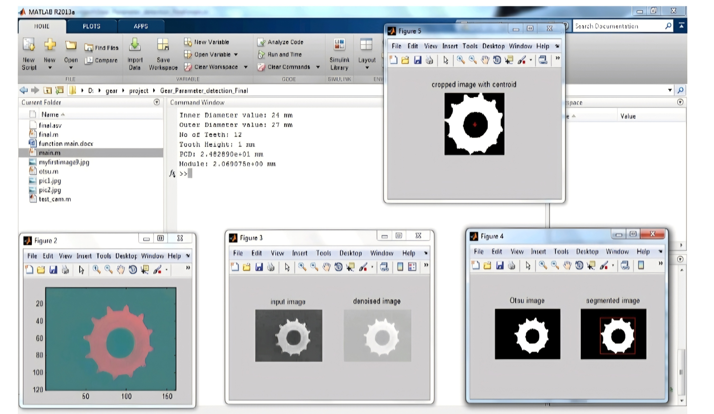
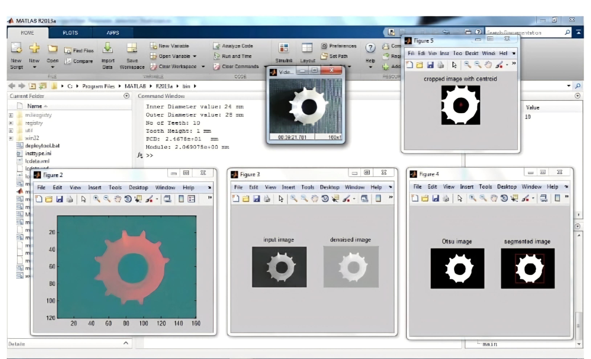

# Automatic Gear Error Detection System

## 📌 Project Overview

The Automatic Gear Error Detection System is a computer vision and automation-based system designed to detect defective gears during the manufacturing process.

The system uses MATLAB image processing techniques to analyze gear images and identify defects based on parameters such as gear shape, outer diameter, inner diameter, and number of teeth. An Arduino Uno is used to control the conveyor and rejection mechanism.

## ⚙️ Technologies Used

- MATLAB
- MATLAB Image Processing
- Arduino Uno
- USB Webcam
- L293 Motor Driver
- Conveyor Belt

## 🔍 Working Principle

1. A gear is placed on the conveyor belt.
2. A USB webcam captures the image of the gear.
3. MATLAB processes the captured image.
4. Noise is removed using a median filter.
5. The image is converted into a binary image using Otsu thresholding.
6. Image properties are extracted using image processing techniques.
7. The detected gear is compared with the required parameters.
8. If the gear is defective, Arduino controls the rejection mechanism.
9. The defective gear is pushed aside automatically.

## 🎯 Objective

To develop an automated and cost-effective system for detecting defective gears and reducing manual inspection in manufacturing industries.

## 📊 Project Parameters

The system analyzes parameters including:

- Outer diameter
- Inner diameter
- Number of teeth
- Gear shape

## 👩‍💻 Project Domain

**Computer Vision | Image Processing | Embedded Systems | Industrial Automation**

## 🚀 Future Scope

The system can be further improved by using advanced machine learning or deep learning techniques for more accurate defect classification and by integrating industrial cameras and automated production-line monitoring.

## 📁 Repository Contents

- `MATLAB/` – MATLAB image processing code
- `Arduino/` – Arduino control code
- `Images/` – Input and output images
- `Documentation/` – Project report and related documents
  ## Results

The proposed system successfully identifies defective and non-defective gears using MATLAB-based image processing.

### Good Gear (Non-Defective)

The system correctly identifies a gear with the expected dimensions and number of teeth.

### Defective Gear

The system detects abnormalities in the gear, such as variation in outer diameter and missing teeth.

### Detection Parameters

| Parameter       | Good Gear | Defective Gear |
| --------------- | --------: | -------------: |
| Outer Diameter  |     27 mm |          28 mm |
| Inner Diameter  |     24 mm |              — |
| Number of Teeth |        12 |             10 |

The results demonstrate that the image-processing algorithm can distinguish between good and defective gears based on their geometric characteristics.

